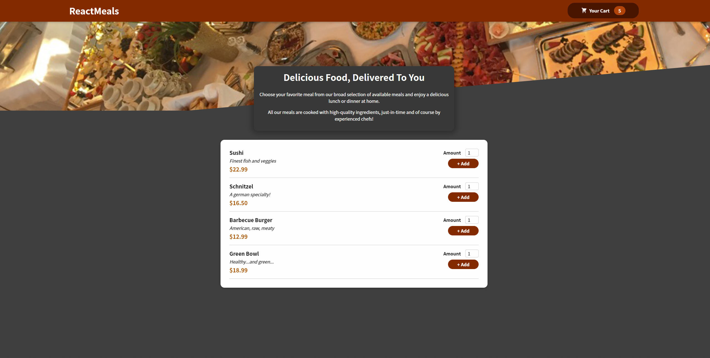
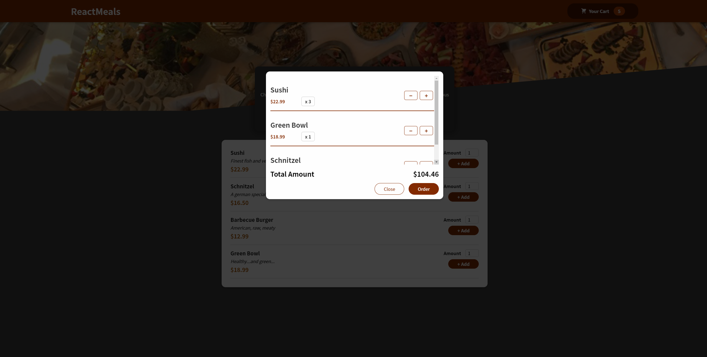

# FoodOrder

A food order website project implemented using React. 

**Main functions:**

* Browse meals in the home page

* Add certain numbers of food into the cart

* View cart, adjust numbers again 

## Start

1. Execute `npm install` in the root directory to make sure you install all the dependencies.
2. Execute `npm start` in the root directory to start the project.
3. Visit `http://localhost:3000` and have fun.

## Preview

